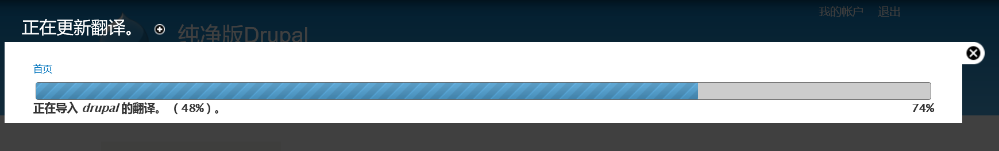
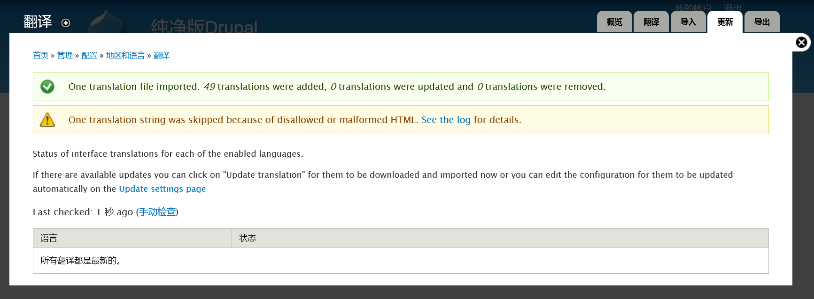
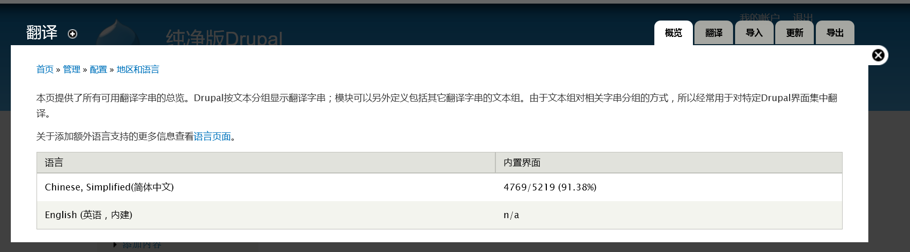
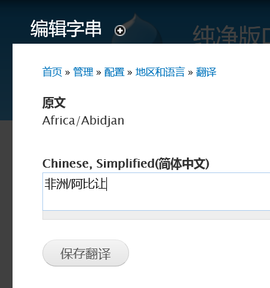
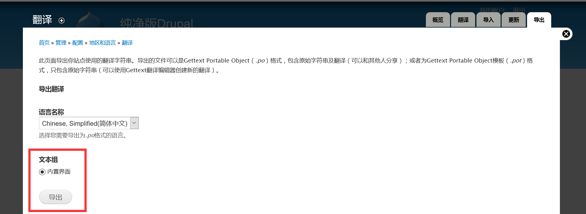
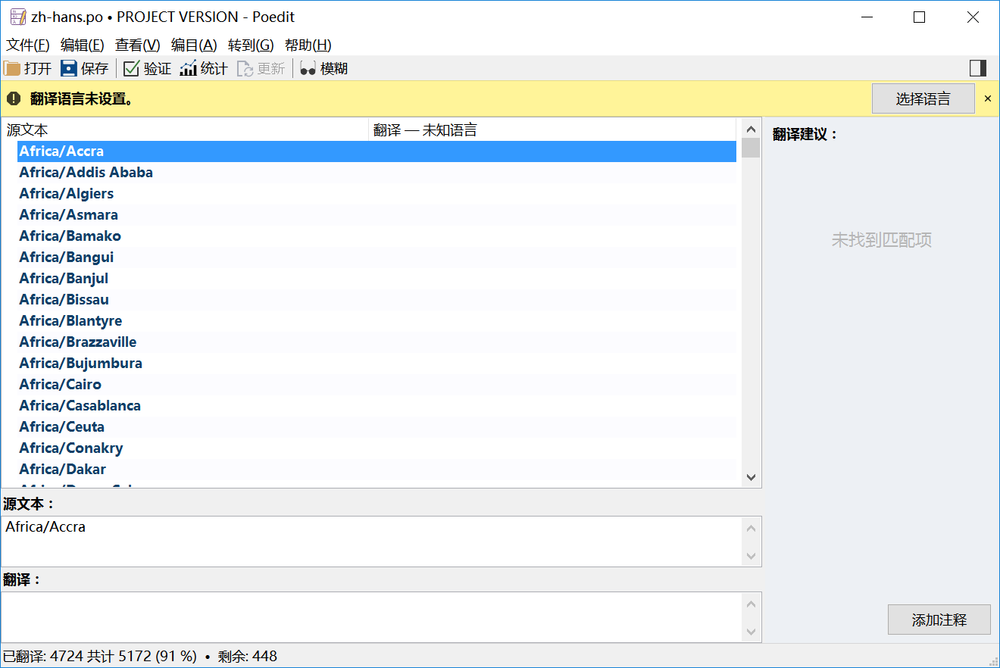
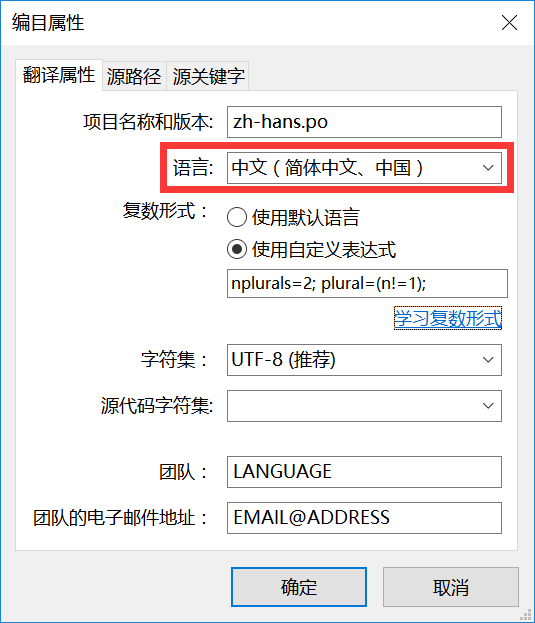
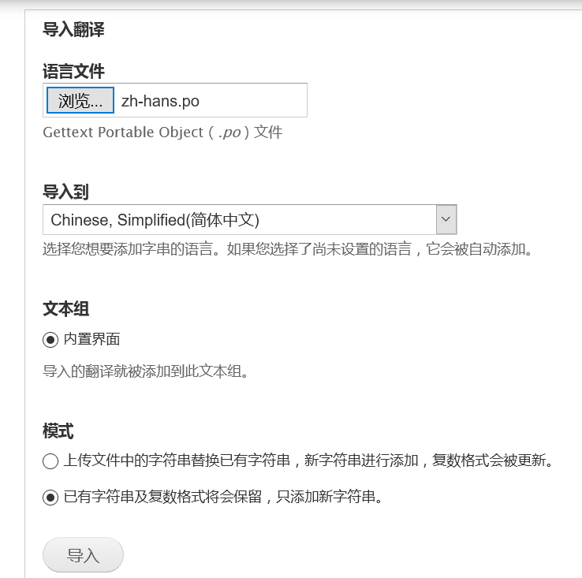
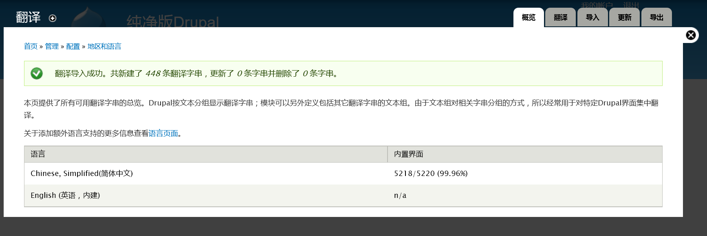

# Drupal翻译

 - [Drupal翻译方法](#Drupal翻译方法)
 - [Drupal翻译中一些特殊字符的含义及处理方法](#Drupal翻译中一些特殊字符的含义及处理方法)

## Drupal翻译方法
> 测试环境：php 	5.5.17 + [Drupal 7.50](https://www.drupal.org/project/drupal/releases/7.50)

安装好Drupal核心包之后，导入[官方汉化文件](http://ftp.drupal.org/files/translations/7.x/drupal/drupal-7.50.zh-hans.po)(.po格式)
在配置>地区和语言>翻译>概览 中看到Drupal7.50的官方汉化率为`4646/5071 (91.62%)`
之后我们在使用Drupal的过程中还会安装启用新的模块。虽然大多数模块都有对应的中文汉化文件。但是汉化率没有100%的。所以还需要我们自己继续翻译。关于Drupal翻译（汉化）的规范请参考：[Drupal 简体中文翻译规范指南 Translators’ Guideline](https://localize.drupal.org/node/5763)
本文介绍几种汉化的方法。
#### 一， 安装启用[Localization update](https://www.drupal.org/project/l10n_update)模块
为什么先讲这个模块。因为这个模块的作用就是自动检查并且更新导入Drupal官方服务器上的翻译文件。启用它之后可以减轻我们汉化的工作量，而且官方的翻译是经过校验审核的，相对准确。
安装启用[Localization update](https://www.drupal.org/project/l10n_update)模块之后，在配置>地区和语言>翻译 中会多一个`更新`的标签。点击`手动检查`，此模块会自动检查Drupal翻译服务器上对应的汉化文件。当发现更新时，会有提示`发现以下模块的更新`。点击`更新翻译`按钮

更新之后的状态：

还有一部分没有汉化。接下来就到我们出手的时候了。
#### 二，逐个翻译方法
切换到翻译标签，点击过滤可翻译的字符串，选择未翻译的字符串，过滤。下面会显示未翻译的字符串。
点击 `编辑`进入翻译界面，例如：

 点击`保存翻译`按钮，即可。
关于翻译中遇到的一些特殊字符，请参考下一节：[Drupal翻译中一些特殊字符的含义及处理方法](http://www.kancloud.cn/wtgg/translations4drupal/213747)。
#### 三，导出-翻译-导入 方法
这里我们需要用到一个翻译软件——[poedit](http://pan.baidu.com/s/1nv4fhKt) 
逐个导入方法，效率比较低。可以导出需要翻译的内容，编辑之后，再导入Drupal系统来进行翻译。
点击`导出`标签，导出`.po文件`，如图：

 
导出翻译之后，用poedit软件打开此po文件。如图：

打开po文件之后会提示您设置需要翻译的语言，选择中文，如图
 
在`翻译`的文本框中输入对应的汉语翻译。可以参考右侧的`翻译建议`。poedit会记忆您曾保存的翻译，当您翻译同一内容的时候，会出现在右侧翻译建议的第1条，按`Ctrl+1`快捷键可快速输入翻译。`Ctrl+↓`进入下一条翻译。
在软件的最下面一栏会显示当前的翻译进度。
当您翻译完成之后，点击保存。切换到`导入`标签，选择您翻译好的po文件，在`模式`中选择`已有字符串及复数格式将会保留，只添加新字符串。`如图：

## Drupal翻译中一些特殊字符的含义及处理方法
1. html标签：
保留html标签及属性值，只翻译标签内容
如`<a href=\"@blocks\">Blocks administration page</a>`
译为`<a href=\"@blocks\">区块管理</a>` 
`<em>vocabulary</em>`译为`<em>词汇表</em>`
2. `@`，`！`，`%`的翻译
>这3个符号是Drupal的占位符。出现在[bootstrap.inc](https://api.drupal.org/api/drupal/includes%21bootstrap.inc/7.x)页面的[format_string()](https://api.drupal.org/api/drupal/includes%21bootstrap.inc/function/format_string/7.x)函数中。(bootstrap.inc页面1788行左右)。3种占位符的含义和用处：
>>`@variable`这种占位符，在替换的时候要调用`check_plain`函数，过滤掉html的特殊字符比如< >等。这个多用于输出内容到drupal的页面。
`!variable`这个在进行键值替换的时候是完全按照值的原样输出，不做任何修改。这种占位符经常用于输出url和邮件地址。
`%variable`这个就更复杂些，会替换html的特殊字符同时还会突出加强显示，过程是hook这个`theme_placeholder()`，默认的hook实现是对值emphasized，即效果值。这个主要用来强调人名，邮件地址等。

翻译方法：保留，并且前后保留一个空格(出现在行首的占位符可以不留空格)。
如：`By !author @time ago`译为`!author 于 @time 之前`

其他：
当参数为单数时  为了能顺利被翻译，请使用`"1 new comment" `而不要使用` "1 new"`，不要用在单数字符串中使用`@count `。  

